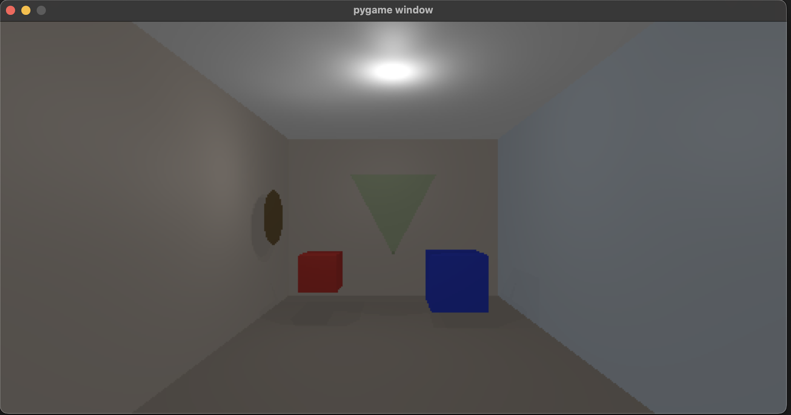

# RTX - Python Ray Tracer

Un motor de ray tracing implementado en Python usando Pygame, capaz de renderizar escenas 3D con geometrías primitivas, iluminación realista, reflexiones, refracciones y diferentes tipos de materiales.



## Características Implementadas

### 🎯 Geometrías Primitivas (Lab 7)
- **Planos**: Planos infinitos para construir paredes, pisos y techos
- **Cubos (AABB)**: Cubos alineados a los ejes con intersection correcta
- **Triángulos**: Triángulos 3D con algoritmo Möller–Trumbore
- **Discos**: Círculos 3D con posición, normal y radio configurables
- **Esferas**: Esferas con coordenadas de textura esféricas (implementación previa)

### 🎨 Materiales Avanzados
- **Materiales Opacos**: Superficies mate con diferentes colores y especularidad
- **Materiales Reflectivos**: Metales pulidos con reflexiones especulares
- **Materiales Transparentes**: Vidrio con refracción y diferentes índices
- **Materiales Optimizados**: Versiones más rápidas para mejor rendimiento

### 💡 Sistema de Iluminación Completo
- **Luz Ambiental**: Iluminación global uniforme
- **Luz Direccional**: Simulación de luz solar con sombras direccionales  
- **Luz Puntual**: Fuentes de luz con atenuación por distancia
- **Luz Spot**: Focos direccionales con ángulos internos y externos
- **Modelo de Phong**: Cálculo completo de iluminación difusa y especular

### 🌍 Efectos Visuales
- **Environment Mapping**: Reflexiones del entorno usando texturas BMP
- **Sombras Proyectadas**: Ray tracing para sombras realistas
- **Reflexiones Recursivas**: Múltiples rebotes para materiales reflectivos
- **Refracción Física**: Implementación de la Ley de Snell y efecto Fresnel

## Estructura del Proyecto

```
RTX/
├── RayTracer.py              # Escena principal del Lab 7
├── gl.py                     # Motor de renderizado y ray casting
├── figures.py                # Geometrías: Sphere, Plane, Triangle, Disk, AABB
├── Material.py               # Materiales y cálculo de superficie
├── lights.py                 # Sistema completo de iluminación
├── intercept.py              # Estructura de datos de intersección
├── Camera.py                 # Sistema de cámara y proyección
├── MathLib.py                # Funciones matemáticas auxiliares
├── refractionFunctions.py    # Cálculos ópticos avanzados
├── BMPTexture.py             # Carga y manejo de texturas
├── BMP_Writer.py             # Exportación de imágenes BMP
├── Fondo.bmp                 # Texture de environment map
└── LAB7.bmp                  # Resultado del Laboratorio 7
```

## Instalación

### Requisitos
- Python 3.8+
- Pygame 2.0+
- NumPy

### Instalación de dependencias
```bash
# Crear entorno virtual (recomendado)
python3 -m venv venv
source venv/bin/activate  # En Windows: venv\Scripts\activate

# Instalar dependencias
pip install pygame numpy
```

## Uso

### Ejecución del Laboratorio 7
```bash
python RayTracer.py
```

Este comando renderiza la escena del Lab 7 que incluye:
- **Un cuarto cerrado** con 5 planos (piso, techo, 3 paredes)
- **Dos cubos** de diferentes tamaños y materiales
- **Un triángulo transparente** en el centro
- **Un disco dorado** en la pared como decoración

### Personalización de Escena

Puedes modificar la escena editando `RayTracer.py`:

```python
# Configuración de resolución (menor = más rápido)
width = 200
height = 150

# Agregar geometrías
rend.scene.append(AABB(
    min_point=[-1, -1, -1], 
    max_point=[1, 1, 1], 
    material=soft_gold
))

rend.scene.append(Disk(
    position=[0, 0, -5], 
    normal=[0, 0, 1], 
    radius=1.0, 
    material=clear_glass
))

# Configurar iluminación
rend.lights.append(AmbientLight(intensity=0.3))
rend.lights.append(DirectionalLight(
    direction=[-1, -1, -1], 
    intensity=0.7
))
```

## Materiales Disponibles

### Materiales Opacos
- `matte_red`: Superficie roja mate
- `glossy_blue`: Azul con acabado brillante  
- `soft_white`: Blanco suave para paredes
- `warm_gray`: Gris cálido para pisos
- `light_beige`: Beige claro para superficies neutras
- `pale_blue`: Azul pálido suave

### Materiales Reflectivos  
- `polished_gold`: Oro altamente reflectivo
- `soft_gold`: Oro con reflexiones suaves (más rápido)
- `lacquer_red`: Rojo con acabado lacado

### Materiales Transparentes
- `clear_glass`: Vidrio transparente sin tinte
- `green_glass`: Vidrio con tinte verdoso

### Materiales Reflectivos
- `polished_gold`: Oro pulido con alta reflexión
- `lacquer_red`: Rojo laqueado con reflexión media

### Materiales Transparentes
- `clear_glass`: Vidrio transparente (IOR: 1.50)
## Laboratorio 7: Geometrías Primitivas

### Objetivo Cumplido ✅
Implementación completa de un ray tracer capaz de renderizar:
- ✅ **5 Planos**: Cuarto cerrado (piso, techo, 3 paredes)
- ✅ **2 Cubos**: AABB con diferentes tamaños y materiales  
- ✅ **1 Triángulo**: Primitiva triangular con transparencia
- ✅ **1 Disco**: Círculo 3D con posición y orientación configurables

### Características Técnicas
- **Ray-Object Intersection**: Algoritmos optimizados para cada geometría
- **Materiales Diversos**: Opacos, reflectivos y transparentes
- **Iluminación Física**: Modelo de Phong con múltiples tipos de luz
- **Manejo de Sombras**: Ray tracing para sombras realistas

## Ejemplos de Uso

### Crear un Cubo (AABB)
```python
cube = AABB(
    min_point=[-1, -1, -1],  # Esquina mínima
    max_point=[1, 1, 1],     # Esquina máxima  
    material=soft_gold
)
rend.scene.append(cube)
```

### Crear un Disco
```python
disk = Disk(
    position=[0, 0, -5],     # Centro del disco
    normal=[0, 0, 1],        # Vector normal (hacia la cámara)
    radius=1.0,              # Radio del disco
    material=polished_gold
)
rend.scene.append(disk)
```

### Crear un Triángulo
```python
triangle = Triangle(
    v0=[0, -1, -5],          # Vértice 1
    v1=[-1, 1, -5],          # Vértice 2  
    v2=[1, 1, -5],           # Vértice 3
    material=green_glass
)
rend.scene.append(triangle)
```

### Configurar Iluminación Optimizada
```python
# Configuración rápida para desarrollo
rend.lights.append(AmbientLight(intensity=0.5))
rend.lights.append(DirectionalLight(direction=[-1, -1, -1], intensity=0.7))

# Configuración completa para render final  
rend.lights.append(PointLight(position=[0, 2, -4], intensity=0.8))
rend.lights.append(SpotLight(position=[2, 1, -3], direction=[-1, -1, 0]))
```

## Salida

El programa genera dos tipos de salida:
1. **Vista en tiempo real**: Ventana de Pygame para visualización interactiva
2. **Imagen final**: Archivo `output.bmp` con el renderizado completo en alta calidad

## Rendimiento

### Configuraciones Recomendadas
```python
# Desarrollo rápido (2-5 segundos)
width, height = 200, 150
maxRecursionDepth = 2
# Solo luz ambiental + direccional

# Render de producción (30-60 segundos)  
width, height = 512, 384
maxRecursionDepth = 3
# Iluminación completa + materiales reflectivos
```

### Factores de Rendimiento
- **Resolución**: Píxeles totales a procesar
- **Materiales reflectivos**: Generan rayos adicionales (recursión)
- **Número de luces**: Cada luz calcula sombras y especularidad
- **Profundidad de recursión**: Rebotes de reflexión/refracción

### Optimizaciones Aplicadas
- Conversión a arrays NumPy para operaciones vectoriales
- Verificación de división por cero en intersecciones
- Materiales optimizados (`soft_gold` vs `polished_gold`)
- Early termination en ray casting

## Desarrollo

### Arquitectura del Sistema
- **Modular**: Cada componente en archivo separado
- **Extensible**: Fácil agregar nuevas geometrías y materiales
- **Mantenible**: Código documentado y estructurado

### Próximas Características Planeadas
- Textura procedural
- Anti-aliasing mejorado  
- Aceleración con BVH (Bounding Volume Hierarchy)
- Soporte para mallas triangulares complejas
- Efectos volumétricos

---

## Créditos

**Autor**: Mario Rocha  
**Curso**: Gráficos por Computadora  
**Laboratorio**: Lab 7 - Geometrías Primitivas  
**Fecha**: Septiembre 2025  

**Tecnologías utilizadas**:
- Python 3.13
- Pygame 2.6.1  
- NumPy para operaciones vectoriales
- Matemáticas de ray tracing y óptica física
  - Número de objetos en la escena
  - Cantidad de luces
  - Profundidad de recursión
  - Materiales transparentes/reflectivos

## Controles

- **ESC**: Salir del programa
- La ventana se actualiza en tiempo real durante el renderizado

## Limitaciones Conocidas

- Solo soporta geometría esférica y planos
- Texturas limitadas a formato BMP
- No incluye aceleración por estructuras espaciales (KD-tree, BVH)
- Renderizado single-threaded

## Desarrollo Futuro

### Características Planeadas
- [ ] Soporte para más formatos de imagen
- [ ] Implementación de más primitivas geométricas
- [ ] Aceleración mediante GPU
- [ ] Importación de modelos 3D
- [ ] Sistema de partículas
- [ ] Volumetric lighting

## Créditos

Proyecto desarrollado como parte del curso de Gráficas por Computadora.

### Tecnologías Utilizadas
- **Python**: Lenguaje principal
- **Pygame**: Manejo de ventanas y eventos
- **NumPy**: Operaciones matemáticas vectoriales

## Licencia

Este proyecto es de uso educativo y está disponible bajo licencia MIT.