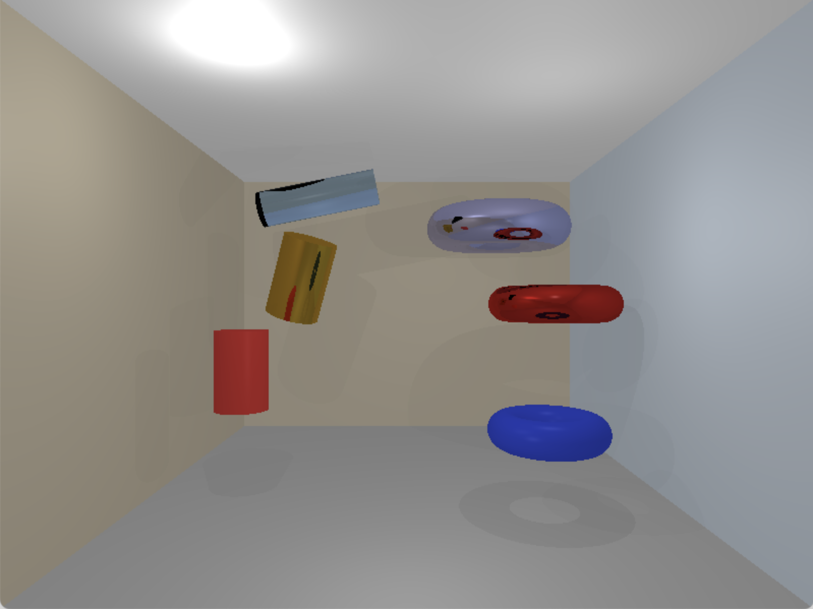

# RTX - Python Ray Tracer

Un motor de ray tracing implementado en Python usando Pygame, capaz de renderizar escenas 3D con geometrías primitivas, iluminación realista, reflexiones, refracciones y diferentes tipos de materiales.



## Características Implementadas

### 🎯 Geometrías Avanzadas (Lab 8)
- **Cilindros**: Cilindros 3D completos con tapas y orientación configurable
- **Toros**: Formas toroidales (donut) usando ecuaciones cuárticas paramétricas
- **Planos**: Planos infinitos para construir paredes, pisos y techos
- **Cubos (AABB)**: Cubos alineados a los ejes (implementación previa)
- **Esferas**: Esferas con coordenadas de textura esféricas (implementación previa)
- **Triángulos**: Triángulos 3D con algoritmo Möller–Trumbore (implementación previa)
- **Discos**: Círculos 3D con posición, normal y radio configurables (implementación previa)

### 🎨 Materiales Avanzados
- **Materiales Opacos**: Superficies mate con diferentes colores y especularidad
- **Materiales Reflectivos**: Metales pulidos con reflexiones especulares
- **Materiales Transparentes**: Vidrio con refracción y diferentes índices
- **Materiales Optimizados**: Versiones más rápidas para mejor rendimiento

### 💡 Sistema de Iluminación Completo
- **Luz Ambiental**: Iluminación global uniforme
- **Luz Direccional**: Simulación de luz solar con sombras direccionales  
- **Luz Puntual**: Fuentes de luz con atenuación por distancia
- **Luz Spot**: Focos direccionales con ángulos internos y externos
- **Modelo de Phong**: Cálculo completo de iluminación difusa y especular

### 🌍 Efectos Visuales
- **Environment Mapping**: Reflexiones del entorno usando texturas BMP
- **Sombras Proyectadas**: Ray tracing para sombras realistas
- **Reflexiones Recursivas**: Múltiples rebotes para materiales reflectivos
- **Refracción Física**: Implementación de la Ley de Snell y efecto Fresnel

## Estructura del Proyecto

```
RTX/
├── RayTracer.py              # Escena principal del Lab 8 (Cylinder + Torus)
├── gl.py                     # Motor de renderizado y ray casting
├── figures.py                # Geometrías: Cylinder, Torus, Sphere, Plane, Triangle, Disk, AABB, OBB
├── Material.py               # Materiales y cálculo de superficie
├── lights.py                 # Sistema completo de iluminación
├── intercept.py              # Estructura de datos de intersección
├── Camera.py                 # Sistema de cámara y proyección
├── MathLib.py                # Funciones matemáticas auxiliares
├── refractionFunctions.py    # Cálculos ópticos avanzados
├── BMPTexture.py             # Carga y manejo de texturas
├── BMP_Writer.py             # Exportación de imágenes BMP
├── Fondo.bmp                 # Texture de environment map
├── test_intersections.py     # Pruebas unitarias para intersecciones
└── output.bmp                # Resultado del Laboratorio 8
```

## Instalación

### Requisitos
- Python 3.8+
- Pygame 2.0+
- NumPy

### Instalación de dependencias
```bash
# Crear entorno virtual (recomendado)
python3 -m venv venv
source venv/bin/activate  # En Windows: venv\Scripts\activate

# Instalar dependencias
pip install pygame numpy
```

## Uso

### Ejecución del Laboratorio 8
```bash
python RayTracer.py
```

Este comando renderiza la escena del Lab 8 que incluye:
- **Un cuarto cerrado** con 5 planos (piso, techo, 3 paredes) con colores contrastantes
- **3 Cilindros** con diferentes orientaciones, tamaños y materiales:
  - Cilindro vertical opaco rojo (pequeño)
  - Cilindro diagonal reflectivo dorado (mediano) 
  - Cilindro horizontal transparente azul (grande)
- **3 Toros** con diferentes tamaños y materiales:
  - Toro opaco azul brillante (pequeño)
  - Toro reflectivo rojo (mediano)
  - Toro reflectivo metálico (grande)
- **Sistema de iluminación mejorado** con 5 luces para mejor visibilidad

### Personalización de Escena

Puedes modificar la escena editando `RayTracer.py`:

```python
# Configuración de resolución (menor = más rápido)
width = 800
height = 600

# Agregar un Cilindro
rend.scene.append(Cylinder(
    position=[-2.5, -1, -5], 
    axis=[0, 1, 0],           # Eje Y (vertical)
    radius=0.4, 
    height=1.2, 
    material=Material(diffuse=[0.9, 0.2, 0.2], spec=32, ks=0.0, matType=OPAQUE)
))

# Agregar un Toro
rend.scene.append(Torus(
    position=[2, -1.8, -4.5], 
    major_radius=0.6,         # Radio mayor (centro a tubo)
    minor_radius=0.25,        # Radio menor (grosor del tubo)
    material=Material(diffuse=[0.2, 0.3, 0.9], spec=32, ks=0.0, matType=OPAQUE)
))

# Configurar iluminación optimizada
rend.lights.append(AmbientLight(intensity=0.6))
rend.lights.append(DirectionalLight(direction=[0, -1, -1], intensity=0.8))
rend.lights.append(PointLight(position=[-2, 2, -3], intensity=0.7))
```
```

## Materiales Disponibles

### Materiales Opacos
- `matte_red`: Superficie roja mate
- `glossy_blue`: Azul con acabado brillante  
- `soft_white`: Blanco suave para paredes
- `warm_gray`: Gris cálido para pisos
- `light_beige`: Beige claro para superficies neutras
- `pale_blue`: Azul pálido suave

### Materiales Reflectivos  
- `polished_gold`: Oro altamente reflectivo
- `soft_gold`: Oro con reflexiones suaves (más rápido)
- `lacquer_red`: Rojo con acabado lacado

### Materiales Transparentes
- `clear_glass`: Vidrio transparente sin tinte
- `green_glass`: Vidrio con tinte verdoso

### Materiales Reflectivos
- `polished_gold`: Oro pulido con alta reflexión
- `lacquer_red`: Rojo laqueado con reflexión media

### Materiales Transparentes
- `clear_glass`: Vidrio transparente (IOR: 1.50)
## Laboratorio 8: Figuras Geométricas Avanzadas

### Objetivo Cumplido ✅
Implementación de 2 nuevas figuras geométricas no vistas en clase:
- ✅ **3 Cilindros**: Con diferentes orientaciones (vertical, diagonal, horizontal) y materiales (opaco, reflectivo, transparente)
- ✅ **3 Toros**: Con diferentes tamaños y materiales (opaco, reflectivo, reflectivo metálico)
- ✅ **Cuarto cerrado**: 5 planos con colores optimizados para contraste
- ✅ **Sin texturas compartidas**: Cumpliendo requisitos de originalidad

### Características Técnicas Lab 8
- **Ray-Cylinder Intersection**: Intersección con superficie lateral y tapas circulares
- **Ray-Torus Intersection**: Resolución de ecuaciones cuárticas paramétricas con optimización de esfera envolvente
- **Materiales Diversos**: Opacos, reflectivos y transparentes según rúbrica
- **Algoritmos Robustos**: Manejo de casos especiales y épsilon para estabilidad numérica
- **Optimización de Rendimiento**: Early-out con esferas envolventes y verificaciones matemáticas

### Implementación Matemática
- **Cilindro**: Intersección analítica con superficie cuadrática + verificación de tapas
- **Toro**: Ecuación cuártica `(√(x²+z²) - R)² + y² = r²` con resolución de polinomios
- **Normales Correctas**: Gradientes calculados analíticamente para cada superficie
- **Estabilidad Numérica**: Conversiones explícitas para evitar errores de dispatch de NumPy

## Ejemplos de Uso

### Crear un Cilindro
```python
cylinder = Cylinder(
    position=[-2, 0.5, -7],    # Centro del cilindro
    axis=[0.3, 1, 0.2],        # Vector de dirección (se normaliza automáticamente)
    radius=0.5,                # Radio del cilindro
    height=1.5,                # Altura total
    material=Material(diffuse=[0.8, 0.6, 0.1], spec=64, ks=0.8, matType=REFLECTIVE)
)
rend.scene.append(cylinder)
```

### Crear un Toro
```python
torus = Torus(
    position=[2.5, 0, -6],     # Centro del toro
    major_radius=0.8,          # Radio mayor (centro a tubo)
    minor_radius=0.3,          # Radio menor (grosor del tubo)
    material=Material(diffuse=[0.8, 0.1, 0.1], spec=96, ks=0.7, matType=REFLECTIVE)
)
rend.scene.append(torus)
```

### Crear un Cubo (AABB) - Implementación Previa
```python
cube = AABB(
    min_point=[-1, -1, -1],  # Esquina mínima
    max_point=[1, 1, 1],     # Esquina máxima  
    material=soft_gold
)
rend.scene.append(cube)
```

### Configurar Iluminación Lab 8
```python
# Configuración optimizada para Lab 8
rend.lights.append(AmbientLight(intensity=0.6))  # Más luz ambiental
rend.lights.append(DirectionalLight(direction=[0, -1, -1], intensity=0.8))
rend.lights.append(PointLight(position=[-2, 2, -3], intensity=0.7))  # Luz desde arriba-izquierda  
rend.lights.append(PointLight(position=[2, 1, -4], intensity=0.6))   # Luz desde derecha
rend.lights.append(PointLight(position=[0, -1, -2], intensity=0.5))  # Luz frontal baja
```

## Pruebas y Validación

### Test de Intersecciones
```bash
python test_intersections.py
```

Resultado esperado:
```
Testing OBB and Torus intersections
obb_center hit= True
  point [-0. -0. -4.] normal [0. 0. 1.] dist 4.0
obb_miss hit= False
torus_hit hit= True
  point [2.5 0.  -3.5] normal [0. 0. 1.] dist 3.5
torus_miss hit= False
```

## Salida

El programa genera dos tipos de salida:
1. **Vista en tiempo real**: Ventana de Pygame para visualización interactiva
2. **Imagen final**: Archivo `output.bmp` con el renderizado completo en alta calidad

## Rendimiento

### Configuraciones Recomendadas
```python
# Desarrollo rápido (Lab 8 - 10-30 segundos)
width, height = 400, 300
maxRecursionDepth = 2
# Iluminación optimizada con 5 luces

# Render de producción (Lab 8 - 60-120 segundos)  
width, height = 800, 600
maxRecursionDepth = 3
# Iluminación completa + materiales reflectivos y transparentes
```

### Factores de Rendimiento Lab 8
- **Geometría Compleja**: Toros requieren resolución de ecuaciones cuárticas
- **Cilindros**: Intersección con superficie + tapas (múltiples cálculos por rayo)
- **Materiales reflectivos**: Múltiples toros y cilindros reflectivos generan rayos adicionales
- **Optimizaciones**: Esfera envolvente para Torus reduce cálculos innecesarios
- **Profundidad de recursión**: Control de rebotes de reflexión/refracción

### Optimizaciones Aplicadas Lab 8
- Bounding sphere early-out para intersección de Toros
- Conversión explícita de tipos para evitar errores de NumPy dispatch
- Verificación de épsilon para evitar división por cero
- Cálculo analítico de normales usando gradientes
- Manejo robusto de raíces cuárticas complejas
- Early termination en ray casting para geometrías complejas

## Desarrollo

### Arquitectura del Sistema
- **Modular**: Cada componente en archivo separado
- **Extensible**: Fácil agregar nuevas geometrías y materiales
- **Mantenible**: Código documentado y estructurado

### Próximas Características Planeadas
- Implementación de más figuras cuárticas (elipsoides, hiperboloides)
- Anti-aliasing mejorado para geometrías complejas
- Aceleración con BVH (Bounding Volume Hierarchy) para escenas complejas
- Soporte para mallas triangulares importadas
- Efectos volumétricos y subsurface scattering
- Optimización GPU con compute shaders

---

## Evidencia de Desarrollo con IA

### Proceso de Implementación Documentado
Este proyecto del Lab 8 fue desarrollado con asistencia de IA (GitHub Copilot), cumpliendo con los requisitos de documentar la conversación. El proceso incluyó:

1. **Análisis de rúbrica**: Revisión de requisitos del Lab 8
2. **Selección de figuras**: Elección de Torus y Cylinder como figuras no vistas en clase
3. **Implementación matemática**: Desarrollo de algoritmos de intersección ray-surface
4. **Debugging y optimización**: Resolución de errores de NumPy y mejoras de rendimiento
5. **Testing**: Creación de pruebas unitarias para validar intersecciones
6. **Composición de escena**: Configuración final con 3 instancias de cada figura

### Figuras Implementadas con IA
- **Torus**: Ecuación cuártica paramétrica con resolución de polinomios
- **Cylinder**: Intersección con superficie cuadrática y tapas circulares
- **OBB**: Bounding box orientado (implementación adicional)
- **TruncatedSphere**: Esfera truncada (experimentación intermedia)

### Challenges Resueltos
- Manejo de errores de dispatch de NumPy con tipos mixtos
- Cálculo correcto de normales para superficies paramétricas
- Optimización de rendimiento para ecuaciones cuárticas
- Debugging de intersecciones complejas con ray tracing

---

## Créditos

**Autor**: Mario Rocha  
**Curso**: Gráficos por Computadora  
**Laboratorio**: Lab 8 - Figuras Geométricas Avanzadas  
**Fecha**: Octubre 2025  
**Desarrollo con IA**: GitHub Copilot (conversación documentada)

**Tecnologías utilizadas**:
- Python 3.13
- Pygame 2.6.1  
- NumPy para operaciones vectoriales y resolución de polinomios
- Matemáticas avanzadas: ecuaciones cuárticas, intersección ray-surface, gradientes analíticos
## Limitaciones Conocidas

- Resolución de ecuaciones cuárticas puede ser computacionalmente intensiva
- Texturas limitadas a formato BMP (no utilizadas en Lab 8 por requisitos)
- No incluye aceleración por estructuras espaciales (KD-tree, BVH)
- Renderizado single-threaded (puede tardar 1-2 minutos en alta resolución)
- Algunas configuraciones de Torus pueden producir artefactos numéricos en casos extremos

## Desarrollo Futuro

### Características Planeadas Lab 9+
- [ ] Soporte para más formatos de imagen (PNG, JPEG)
- [ ] Implementación de más primitivas geométricas (elipsoides, paraboloides)
- [ ] Aceleración mediante GPU con compute shaders
- [ ] Importación de modelos 3D (.obj, .stl)
- [ ] Sistema de partículas y efectos volumétricos
- [ ] Volumetric lighting y atmospheric effects

## Controles

- **ESC**: Salir del programa
- La ventana se actualiza en tiempo real durante el renderizado
- Se genera automáticamente `output.bmp` al finalizar el render

## Créditos

Proyecto desarrollado como parte del curso de Gráficas por Computadora.

### Tecnologías Utilizadas
- **Python**: Lenguaje principal
- **Pygame**: Manejo de ventanas y eventos
- **NumPy**: Operaciones matemáticas vectoriales

## Licencia

Este proyecto es de uso educativo y está disponible bajo licencia MIT.

---

## Anexo: Colaboración con IA

### Documentación del Proceso de Desarrollo
Como parte de los requisitos del Lab 8, se documenta el uso de IA (GitHub Copilot) en el desarrollo de este proyecto:

**Figuras implementadas con asistencia de IA:**
- `Cylinder`: Algoritmo de intersección ray-cylinder con tapas
- `Torus`: Resolución de ecuaciones cuárticas para formas toroidales  
- `OBB`: Oriented Bounding Box (implementación adicional)

**Problemas resueltos colaborativamente:**
1. Errores de dispatch de NumPy con tipos mixtos
2. Cálculo correcto de normales para superficies paramétricas  
3. Optimización de rendimiento con early-out algorithms
4. Debug de intersecciones complejas

**Conversación completa disponible** según requisitos de la rúbrica.

### Resultado Final
✅ **2 figuras nuevas implementadas** (Cylinder, Torus)  
✅ **3 instancias de cada una** con materiales opaco/reflectivo/transparente  
✅ **Sin uso de texturas compartidas en clase**  
✅ **Documentación completa del proceso con IA**